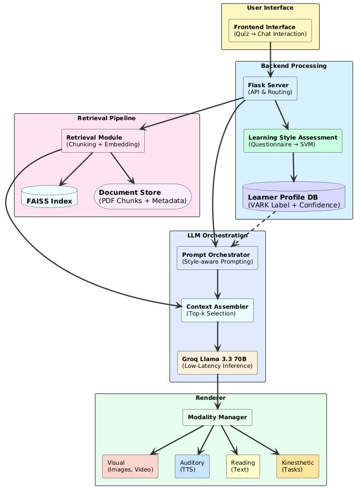

# Cognitive Chatbot – VARK-Based Adaptive Tutor (RAG + LLM)

A multimodal AI-powered chatbot that personalizes learning experiences based on the user's **VARK learning style** (Visual, Auditory, Read/Write, Kinesthetic). Combines a **quiz-based SVM classifier**, a **RAG pipeline**, and **Groq-hosted LLaMA 3.3** to deliver fast, personalized, and explainable responses.

**Accepted for publication – Springer Conference 2025**

---

## 📌 Key Features

- 🧠 **Learning Style Assessment**  
  Users answer a 15-question quiz; an ML classifier infers their preferred VARK style (with confidence score).

- 📚 **RAG-Based QA System**  
  Questions trigger retrieval from a local document store using **FAISS**, followed by contextual answer generation from a **low-latency Groq-hosted LLaMA 3.3**.

- 🗣️ **Modality Switching**  
  Responses are rendered in the user's preferred format. Modalities include:  
  - 🎨 Visual (Images, Videos)  
  - 🔊 Auditory (Text-to-Speech)  
  - 📖 Read/Write (Text Explanation)  
  - 🧩 Kinesthetic (Task-Based Guidance)

- ⚡ **Low Latency + Modular Design**  
  Entire pipeline runs via **Flask**, enabling scalable deployment and easy frontend integration.

---

## 🧭 System Architecture



---

## 🛠️ Tech Stack

- **Python**, **Flask** (API, routing, web interface)
- **Scikit-learn** (SVM classifier for learning style)
- **FAISS** (document retrieval and vector search)
- **Groq LLaMA 3.3 (70B)** – hosted LLM API
- **HTML/CSS/JS** (frontend UI)
- **Text-to-Speech**, media renderer (modal switching)
- **PDF & Metadata Indexing**

---

### 📦 Installation

```bash
git clone https://github.com/bragadeez/CognitiveChatbot
cd CognitiveChatbot
pip install -r requirements.txt
