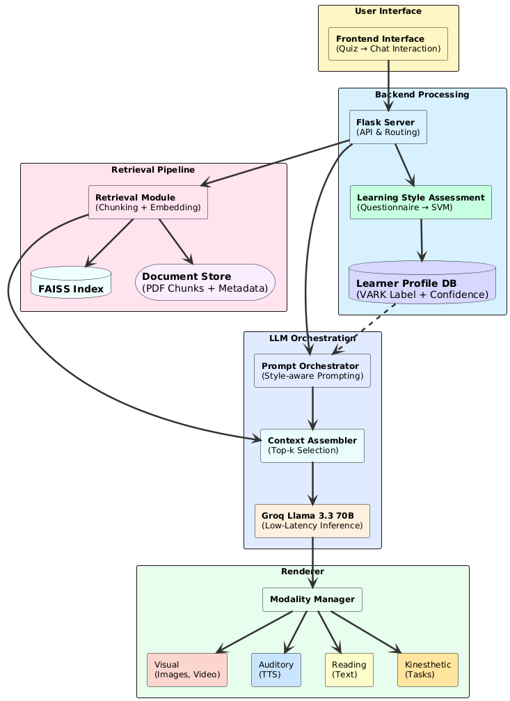

# Cognitive Chatbot: Personalized Learning using VARK, RAG, and LLMs

[](#)
[](#)
[](LICENSE)
[](#)

Cognitive Chatbot is an intelligent adaptive educational platform that personalizes learning according to each student's cognitive learning style. Using the VARK learning model (Visual, Auditory, Reading/Writing, and Kinesthetic), the system dynamically adapts explanations, diagrams, videos, quizzes, and examples to match how each learner understands concepts most effectively.

Instead of being limited to a single subject, the chatbot can support any domain by simply replacing or expanding its knowledge base. Through Retrieval-Augmented Generation (RAG), it retrieves relevant information from uploaded educational materials before generating responses, enabling accurate, context-aware tutoring across multiple subjects.

The system utilizes a Support Vector Machine (SVM) classifier to diagnose learning styles from a 15-question diagnostic questionnaire. User queries are processed through a Retrieval-Augmented Generation (RAG) pipeline powered by a FAISS vector database and Groq-hosted Llama 3.3 (70B). Relevant educational content is retrieved before response generation, allowing the chatbot to deliver grounded, personalized, and subject-independent explanations.

---

## Why the Project is Useful

Most educational chatbots provide the same explanation to every learner regardless of how they learn best. Cognitive Chatbot addresses this challenge by combining cognitive learning style adaptation with Retrieval-Augmented Generation to provide personalized, context-aware learning experiences.

The platform offers:
*   **VARK Personalization**: Classifies students into distinct learning modalities and shapes responses dynamically.
*   **Context Preservation**: Maintains multi-turn conversation memory (last 10 turns) across style changes.
*   **RAG over Authoritative Sources**: Grounds answers in course materials using vector embeddings, preventing AI hallucinations.
*   **Tactile User Interface**: Styled using a Wabi-Sabi paper design layout with custom SVG icons and a floating toast active-style notification.

---

# System Architecture

The Cognitive Chatbot follows a modular architecture that combines cognitive learning style detection, Retrieval-Augmented Generation (RAG), conversational memory, and Large Language Models to deliver personalized educational assistance.

<p align="center">
  
</p>

---

## How Users Can Get Started

### Prerequisites
*   **Python**: Version 3.10 or higher.
*   **Node.js**: Version 18 or higher (with `npm`).
*   **API Key**: A valid Groq API Key ([Get one here](https://console.groq.com/)).

### 1. Installation
Clone the repository and navigate to the project root:
```bash
git clone https://github.com/bragadeez/CognitiveChatbot
cd CognitiveChatbot/Implementation
```

### 2. Configure Virtual Environment
Create and activate a Python virtual environment:

```bash
# Windows (PowerShell)
python -m venv .venv
.venv\Scripts\Activate.ps1

# macOS / Linux
python3 -m venv .venv
source .venv/bin/activate
```

Install the required Python dependencies:
```bash
pip install -r backend/requirements.txt
```

### 3. Environment Variables
Copy the dotenv template:
```bash
# Windows (Cmd)
copy .env.example .env

# macOS / Linux / PowerShell
cp .env.example .env
```
Open `.env` and fill in your credentials:
```env
API_KEY=your_groq_api_key_here
GROQ_MODEL=llama-3.3-70b-versatile

# Optional Supabase variables (runs in-memory if empty)
SUPABASE_URL=
SUPABASE_ANON_KEY=
```
*Note: Diagnostic questionnaire models are pre-loaded from [models/](models/) and vector indices from [vectorstore/](vectorstore/) recursively.*

### 4. Client Build
Install the frontend node modules:
```bash
cd frontend
npm install
cd ..
```

### 5. Running Locally
Launch the backend and frontend in **two separate terminal windows** inside `Implementation/`:

*   **Terminal 1 (FastAPI Backend)**:
    ```bash
    # Activate virtual environment first
    uvicorn backend.main:app --reload --port 8000
    ```
*   **Terminal 2 (React Frontend)**:
    ```bash
    cd frontend
    npm run dev
    ```

Open your browser to **http://localhost:5173**. The client Vite proxy redirects requests from `/api/*` to the local FastAPI port `8000` automatically.

---

## Where Users Can Get Help

*   **API Docs**: When running the backend server locally, navigate to `http://localhost:8000/docs` to view the interactive OpenAPI/Swagger definitions.
*   **Issue Tracking**: Report bugs or suggest features on our repository's [GitHub Issues Tracker](https://github.com/bragadeez/CognitiveChatbot/issues).
*   **Supabase Schema Setup**: For configuring the Postgres database layer and cloud bucket storage, run the SQL script in [supabase_migration.sql](supabase_migration.sql).
*   **SVM Training**: Read the setup for retraining the VARK classifier model in [train_svm_model.py](train_svm_model.py).

---

## Who Maintains and Contributes

*   **Maintainer**: bragadeez
*   **Contributions**: We welcome bug fixes and features! Please read our [Contributing Guidelines](docs/CONTRIBUTING.md) to understand coding styles, git branch workflows, and PR expectations before opening a pull request.
*   **License**: Distributed under the MIT license. See [LICENSE](LICENSE) for details.
